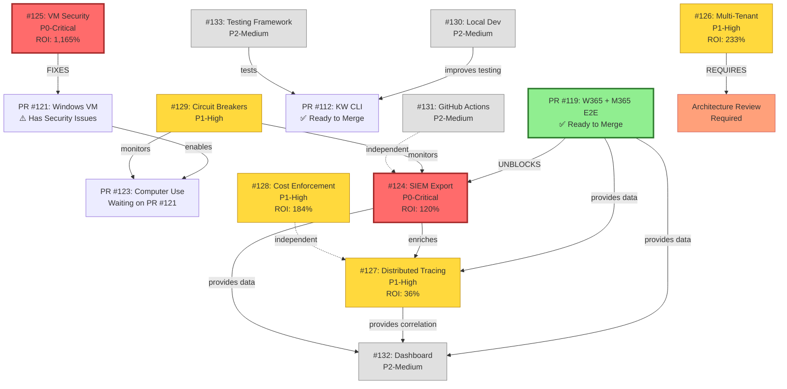

# Enhancement Dependency Graph

**Standalone visual reference for enhancement dependencies**

See [Enhancement Dependencies](../specs/ENHANCEMENT_DEPENDENCIES.md) for detailed analysis.

---

## Complete Dependency Graph



**Legend**:
- 🟢 Green (thick border): Ready to merge - MERGE FIRST
- 🔴 Red: P0-Critical enhancements
- 🟡 Yellow: P1-High enhancements
- ⬜ Gray: P2-Medium enhancements
- 🟠 Orange: Prerequisites (architecture review)
- Solid arrows: Hard dependencies (MUST complete first)
- Dashed arrows: Soft dependencies (BETTER if completed first)

---

## Critical Path

**The fastest path to all enhancements**:

```
Week 1:    Merge PR #119 ───────┐
                                 ├─→ START #124 (SIEM Export)
Week 1-2:  START #125 (VM Sec) ─┘
                                 │
Week 3-4:  COMPLETE #125 ────────┼─→ Merge PR #121
                                 │           │
Week 4-7:  COMPLETE #124 ────────┘           ├─→ Merge PR #123
                                             │
Week 5-6:  START #128 (Cost) ────────────────┤
Week 5-7:  START #127 (Tracing) ─────────────┤
Week 8-13: START #126 (Multi-Tenant) ────────┤
Week 8-10: COMPLETE #128 & #127 ─────────────┘
Week 14+:  BEGIN P2-Medium enhancements
```

**Total timeline**: ~14 weeks for all P0 + P1 enhancements (with parallelization)

---

## Dependency Rules

### HARD BLOCKERS (Must complete first)
- PR #119 → Issue #124 (SIEM Export)
- Issue #125 → PR #121 (VM Security fixes PR)
- PR #121 → PR #123 (Computer Use)
- Architecture Review → Issue #126 (Multi-Tenant)

### SOFT DEPENDENCIES (Better if complete)
- Issue #124 → Issue #127 (SIEM enriches tracing)
- Issues #124 + #127 → Issue #132 (Dashboard needs data)
- Issue #130 → PR #112 (Local dev improves CLI testing)

### INDEPENDENT (Can start anytime)
- Issue #125: Windows VM Security
- Issue #128: Cost Budget Enforcement
- Issue #129: Circuit Breakers
- Issue #131: GitHub Actions Agent
- Issue #133: Testing Framework

---

## Parallelization Opportunities

**Week 1-2** (2 parallel tracks):
- Track A: Merge PR #119
- Track B: Start Issue #125 (VM Security)

**Week 4-7** (3 parallel tracks):
- Track A: Complete Issue #124 (SIEM Export)
- Track B: Start Issue #128 (Cost Enforcement)
- Track C: Start Issue #127 (Distributed Tracing)

**Week 8-13** (2 parallel tracks):
- Track A: Issue #126 (Multi-Tenant) - complex, needs dedicated focus
- Track B: Complete #128 + #127

**Maximum Parallelization**: 3 tracks simultaneously (requires 3 FTE)

---

## Dependency Impact Analysis

**If PR #119 is NOT merged**:
- ❌ Cannot start Issue #124 (SIEM Export)
- ⚠️ Issue #127 (Tracing) has partial data only
- ⚠️ Issue #132 (Dashboard) missing telemetry source
- 📉 3 enhancements blocked or degraded

**If Issue #125 is NOT completed**:
- ❌ PR #121 cannot merge safely (security vulnerabilities)
- ❌ PR #123 cannot proceed (depends on #121)
- 🔒 Production deployment blocked (security compliance)

**If Architecture Review delayed** (for #126):
- ⚠️ Multi-tenant may require rework if built without review
- 💰 Risk of wasted investment ($90K development)
- 📅 Potential Q2 timeline delay

---

## Quick Reference

**What blocks what** (one line per blocker):
- PR #119 blocks #124, #127, #132
- #125 blocks PR #121 → blocks PR #123
- Arch Review blocks #126

**What can start immediately** (no blockers):
- #125, #128, #129, #130, #131, #133

**What should wait** (until dependencies complete):
- #124: Wait for PR #119
- #132: Wait for #124 + #127
- #126: Wait for architecture review

---

## Related Documentation

- [Enhancement Dependencies](../specs/ENHANCEMENT_DEPENDENCIES.md) - Complete analysis
- [Enhancement Roadmap](ENHANCEMENT_ROADMAP.md) - Strategic overview
- [Visual Roadmap](VISUAL_ROADMAP.md) - Additional diagrams

---

**Use this graph to understand** what can be parallelized and what must be sequential.