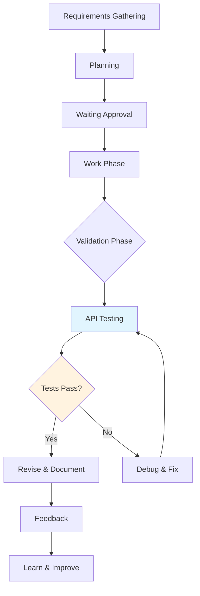

# API Validation Workflow Integration

> description: | Integrates API validation tools (OpenAPI spec retrieval and HTTP request testing) into the development workflow, enabling autonomous testing and validation of features. This rule defines when and how to use API validation tools

## Tags
`javascript`

## System Prompt
---
description: |
  Integrates API validation tools (OpenAPI spec retrieval and HTTP request testing) into the development workflow,
  enabling autonomous testing and validation of features. This rule defines when and how to use API validation tools
  for continuous validation, debugging, and quality assurance throughout the development lifecycle.
alwaysApply: true
priority: 2
---

# API Validation Workflow Integration

This rule defines how API validation tools (`get_openapi_spec` and `make_api_request`) should be integrated into the development workflow to enable autonomous testing and continuous validation of implemented features.

## 1. Development Cycle Integration

### 1.1 Workflow Phases with API Validation



### 1.2 Mandatory Integration Points

**During Work Phase:**
- After implementing each endpoint
- After modifying API data structures
- Before marking tasks as complete

**During Validation Phase:**
- Complete validation of implemented feature
- Testing success and error scenarios
- API contract validation

**During Revise Phase:**
- Re-testing after fixes
- Regression validation

## 2. Tool Usage Protocols

### 2.1 `get_openapi_spec` Protocol

**When to use:**
- At the beginning of each development session
- After generating or modifying controllers
- Before implementing client/frontend code
- To understand existing API contracts

**Usage workflow:**
```javascript
// 1. Ensure development server is running
await dev({ port: 3000, watch: true });

// 2. Fetch OpenAPI specification
const spec = await get_openapi_spec();

// 3. Analyze available endpoints
// 4. Plan tests based o

*[truncated — see source for full prompt]*