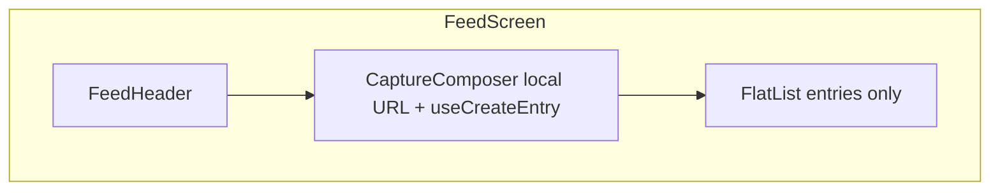

# Feed Screen Refactor Plan

> ## Goals

- Remove all **inline header and URL state** from [`FeedScreen`](apps/mobile/src/features/entry/screens/FeedScreen/index.tsx): no `ListHeade

## Model
- **Default:** `claude-sonnet-4-5`

## System Prompt
# Feed screen refactor (header, capture, list performance)

## Goals

- Remove all **inline header and URL state** from [`FeedScreen`](apps/mobile/src/features/entry/screens/FeedScreen/index.tsx): no `ListHeaderComponent` for title/composer, no `useState` for URL on the screen.
- Add **`FeedHeader`**: feed title + signed-in context only.
- Add a **named capture component** (default name: **`CaptureComposer`**) as the **primary UI for adding resources** (URLs first; extensible later), using HeroUI Native **[`InputGroup`](https://heroui.com/docs/native/components/input-group)** with prefix icon and integrated suffix action (button), per design system tokens (no raw hex for icons — `useThemeColor` / semantic classes).
- Keep prior performance intent: **memoized row** + **stable `onPressEntry`**, stable FlatList props; optionally **`FeedListItem`** as before.

## Naming

| Option | Rationale |
|--------|-----------|
| **`CaptureComposer`** (recommended) | Matches “composer” patterns (chat/social); reads well next to `FeedHeader`. |
| `PrimaryCaptureField` | Emphasizes “main entry point” literally. |
| `ResourceIngestBar` | Ties to `ai.ingest` / server language; slightly jargon-heavy. |

**File path:** `apps/mobile/src/features/entry/components/CaptureComposer/index.tsx` (and `index.styles.ts` only if `tv` variants are needed).

**Required file comment** (top of `index.tsx`): one short note that this component is the **main entry point for adding resources** to the user’s memory (URLs in MVP; future types can extend the same surface).

## Layout and behavior

- **Column layout** (`View` with `flex-1`): `FeedHeader` → `CaptureComposer` → `ScrollEdgeFade` → `FlatList`.
- **`FlatList`** receives **only** `entries` — no `ListHeaderComponent` for chrome. Footer, empty, refresh, pagination 

*[truncated — see source for full prompt]*