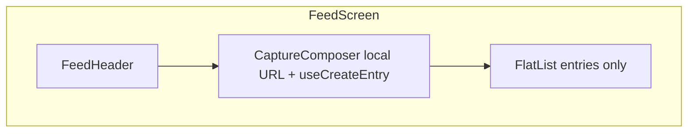

# Feed screen refactor (header, capture, list performance)

## Goals

- Remove all **inline header and URL state** from [`FeedScreen`](apps/mobile/src/features/entry/screens/FeedScreen/index.tsx): no `ListHeaderComponent` for title/composer, no `useState` for URL on the screen.
- Add **`FeedHeader`**: feed title + signed-in context only.
- Add a **named capture component** (default name: **`CaptureComposer`**) as the **primary UI for adding resources** (URLs first; extensible later), using HeroUI Native **[`InputGroup`](https://heroui.com/docs/native/components/input-group)** with prefix icon and integrated suffix action (button), per design system tokens (no raw hex for icons — `useThemeColor` / semantic classes).
- Keep prior performance intent: **memoized row** + **stable `onPressEntry`**, stable FlatList props; optionally **`FeedListItem`** as before.

## Naming

| Option | Rationale |
|--------|-----------|
| **`CaptureComposer`** (recommended) | Matches “composer” patterns (chat/social); reads well next to `FeedHeader`. |
| `PrimaryCaptureField` | Emphasizes “main entry point” literally. |
| `ResourceIngestBar` | Ties to `ai.ingest` / server language; slightly jargon-heavy. |

**File path:** `apps/mobile/src/features/entry/components/CaptureComposer/index.tsx` (and `index.styles.ts` only if `tv` variants are needed).

**Required file comment** (top of `index.tsx`): one short note that this component is the **main entry point for adding resources** to the user’s memory (URLs in MVP; future types can extend the same surface).

## Layout and behavior

- **Column layout** (`View` with `flex-1`): `FeedHeader` → `CaptureComposer` → `ScrollEdgeFade` → `FlatList`.
- **`FlatList`** receives **only** `entries` — no `ListHeaderComponent` for chrome. Footer, empty, refresh, pagination unchanged in spirit.
- **Fixed top** (header + capture) does not scroll with the list; list scrolls independently. This avoids header work inside `VirtualizedList` and matches the “bigger refactor” ask.

## Component responsibilities

### `FeedHeader`

- Props: optional `className` / minimal layout hooks if needed; or zero props if it reads `useAuthStore` internally (same as today).
- Renders: “Feed” title, “Signed in as …” when email exists.
- **Reuse** in the **error** branch of `FeedScreen` (today duplicated markup) so one component defines the top chrome.

### `CaptureComposer`

- Owns **local** `useState` for the URL string.
- Uses **`useCreateEntry`**, **`useAppToast`**, same mutation success/error behavior as current `FeedScreen`.
- UI: **`InputGroup`** from `heroui-native`:
  - **`InputGroup.Prefix`** + **`isDecorative`**: leading icon (e.g. link / add — align with [`EntryCard`](apps/mobile/src/features/entry/components/EntryCard/index.tsx) which uses `MaterialIcons` `link` for URL type).
  - **`InputGroup.Input`**: placeholder, `value` / `onChangeText`, submit-friendly (`returnKeyType` / `onSubmitEditing` optional to match “Add”).
  - **`InputGroup.Suffix`**: primary **Add** control (HeroUI `Button` or `Pressable` per HeroUI guidance for interactive suffix — **not** `isDecorative` on the suffix).
- Wrap with **`TextField`** + **`Label`** only if we need accessibility parity with the current field; otherwise follow the doc’s “Basic” / integrated pattern. If `isDisabled` is needed during mutation, use **`InputGroup isDisabled`** (see HeroUI docs).
- **No** URL logic remains in `FeedScreen`.

### `FeedScreen`

- Composes `FeedHeader`, `CaptureComposer`, list; keeps query, error UI, `FeedListItem` / `onPressEntry`, `ScrollEdgeFade`, insets, padding tokens from [`layout-imperative.ts`](apps/mobile/src/theme/layout-imperative.ts).

## Performance (unchanged from prior plan)

- **`FeedListItem`**: `React.memo`; parent passes **`onPressEntry(id)`** via `useCallback`.
- **`keyExtractor`**, **`contentContainerStyle`**, **`refreshControl`**: stable with `useCallback` / `useMemo`.

## Files to add

| Path | Role |
|------|------|
| `apps/mobile/src/features/entry/components/FeedHeader/index.tsx` | Title + email |
| `apps/mobile/src/features/entry/components/CaptureComposer/index.tsx` | InputGroup + icon + add; resource entry comment |
| Optional `CaptureComposer/index.styles.ts` | `tv` only if variants needed |

## Files to change

| Path | Change |
|------|--------|
| [`FeedScreen/index.tsx`](apps/mobile/src/features/entry/screens/FeedScreen/index.tsx) | Strip header/URL; new layout; wire `FeedListItem`; error state uses `FeedHeader` |

## Verification

- Manual: add URL, loading/disabled states, pull-to-refresh, infinite scroll, navigation to entry detail.
- Lint/typecheck for `apps/mobile`.

## Out of scope

- New dependencies (InputGroup is part of existing `heroui-native`).
- Server or `useEntries` contract changes.