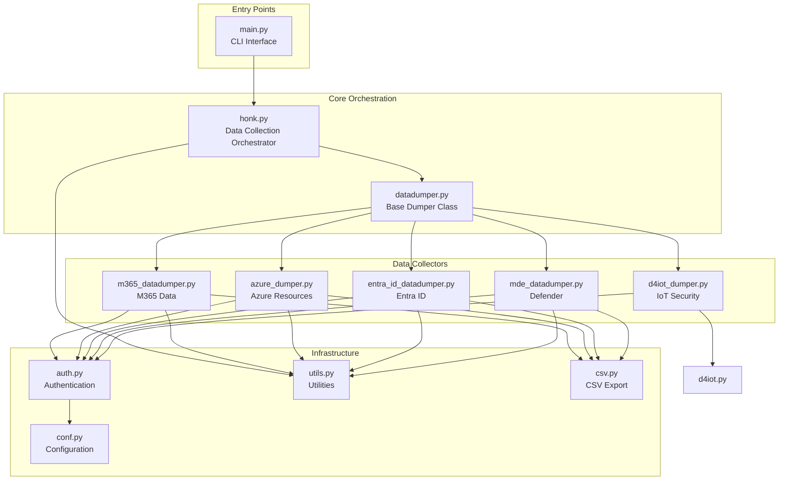

# Gen Docs For Goose

> Generate comprehensive module documentation for the Goose tool's mdBook in docs/src/developers/modules/, providing top-down analysis of functionality,

## Model
- **Default:** `claude-sonnet-4-5`

## System Prompt
# Goal

Generate comprehensive module documentation for the Goose tool's mdBook in docs/src/developers/modules/, providing top-down analysis of functionality, inter-module
relationships, business purposes, and detailed implementation documentation with visual diagrams.

# Documentation Structure

1. Overview Documentation (docs/src/developers/modules/index.md)

Create a top-level architecture document that includes:

# Goose Tool Module Architecture

## Overview
[High-level description of Goose's purpose as an incident response and hunt tool for Microsoft cloud environments]

## Architecture Diagram

Module Categories

1. Entry Points

- main.py: CLI entry point using Google Fire

2. Core Orchestration

- honk.py: Main orchestration engine
- datadumper.py: Base class for all data collectors

3. Infrastructure Services

- auth.py: Microsoft auth

*[truncated — see source for full prompt]*