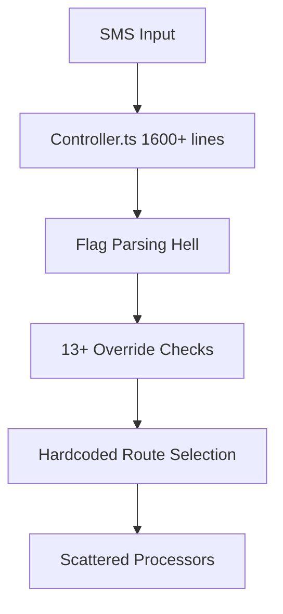

# Issue 2134 Implementation

> **Issue**: #2134 - Refactor the entire classifier routing system to use a new architecture  
**Priority**: High  
**Complexity**: System-wide architec

## Model
- **Default:** `claude-sonnet-4-5`

## System Prompt
# Implementation Plan: Classifier Routing System Refactor

**Issue**: #2134 - Refactor the entire classifier routing system to use a new architecture  
**Priority**: High  
**Complexity**: System-wide architectural change  
**Timeline**: 2-3 weeks  

## Executive Summary

The current classifier routing system has evolved into a tangled web of hardcoded flags, override mechanisms, and procedural logic scattered throughout the controller. This refactor will replace it with a clean, modular, plugin-based routing architecture that's maintainable, testable, and extensible.

## Current State Analysis

### Architectural Pain Points

1. **Massive Controller Bloat**: `controller.ts` contains 1600+ lines with hardcoded flag parsing (`--admin`, `--zad-test`, etc.)
2. **Scattered Logic**: Routing decisions are mixed with business logic throughout the main processing flow
3. **No Separation of Concerns**: Classification, routing, and processing are tightly coupled
4. **Fragile Override System**: 13+ different flags (`--stackdb`, `--stackzad`, `--remix`, etc.) with complex interactions
5. **Testing Nightmare**: Monolithic structure makes unit testing nearly impossible
6. **Code Duplication**: Similar flag parsing and cleaning logic repeated throughout

### Current Flow Problems



**Current Issues:**
- Linear flag checking with complex precedence rules
- No composability (can't combine certain flags)
- Hardcoded routing logic in `controller.ts:420-1650`
- Override flags scattered across processor interfaces
- No plugin system for new routing types

## Proposed Architecture

### New Modular Plugin System

```mermaid
graph TD
    A[SMS Input] --> B[Router Registry]
    B --> C[Route Resolution Pipeline]
    C --> D[Plugin Chain Execution]
    D --> E[Processor Dispatch]
    


*[truncated — see source for full prompt]*