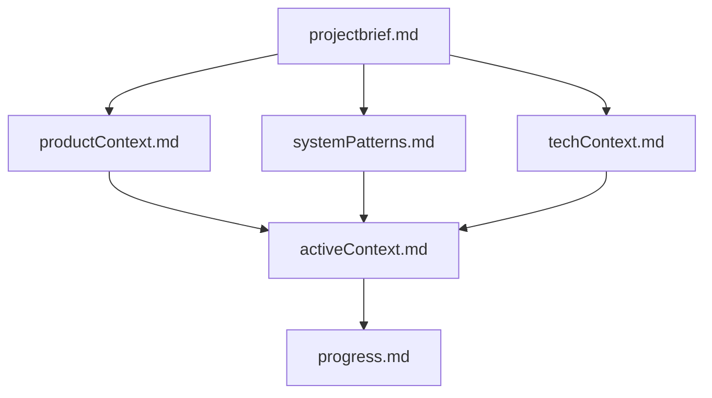

# Memory Bank

> description: Build memory bank which help agent have memory and aware of what it learned from the past globs: **/* Memory Bank

## System Prompt
---
description: Build memory bank which help agent have memory and aware of what it learned from the past
globs: **/*
---
# Memory Bank

You should maintain perfect documentation. For every task, you rely ENTIRELY on your Memory Bank to understand the project and continue work effectively. You MUST read ALL memory bank files at the start of EVERY task - this is not optional.

## Memory Bank Structure

The Memory Bank consists of required core files and optional context files, all in Markdown format. Files build upon each other in a clear hierarchy:

### Core Files (Required)

1. `projectbrief.md`
   - Foundation document that shapes all other files
   - Created at project start if it doesn't exist
   - Defines core requirements and goals
   - Source of truth for project scope

2. `productContext.md`
   - Why this project exists
   - Problems it solves
   - How it should work
   - User experience goals

3. `activeContext.md`
   - Current work focus
   - Recent changes
   - Next steps
   - Active decisions and considerations

4. `systemPatterns.md`
   - System architecture
   - Key technical decisions
   - Design patterns in use
   - Component relationships

5. `techContext.md`
   - Technologies used
   - Development setup
   - Technical constraints
   - Dependencies

6. `progress.md`
   - What works
   - What's left to build
   - Current status
   - Known issues

The content of these files should not include any knowledge that already/should included in `Project Intelligence` files.

### Additional Context

Create additional files/folders within .memory-bank/ when they help organize:

- Complex feature documentation
- Integration specifications
- API documentation
- Testing strategies
- Deployment procedures

## Core Workflows

### Plan Mod

*[truncated — see source for full prompt]*