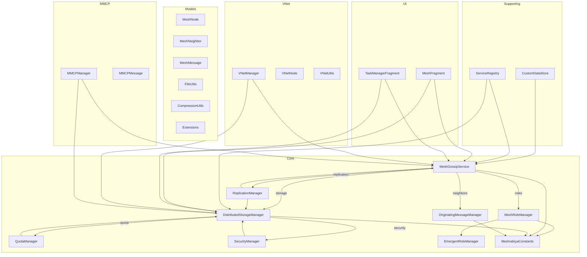

# Meshrabiya Module: Complete Architecture Overview

This document provides a comprehensive architecture diagram and mapping of all non-test Java/Kotlin files in the Meshrabiya module, including their relationships, responsibilities, and integration points.

---

## 1. Core Managers & Services

- **MeshGossipService.kt**
  - Mesh-wide messaging, gossip protocol, chunk/file transfer.
  - Consumes neighbor lists from `OriginatingMessageManager`.
  - Owns `CustomDataStore`.
  - Integrates with `ReplicationManager`, `MeshRoleManager`, and storage managers.

- **OriginatingMessageManager.kt**
  - Maintains mesh topology, neighbor health, routing, node announcements.
  - Provides neighbor lists to `MeshGossipService`.

- **EmergentRoleManager.kt** / **MeshRoleManager.kt**
  - Role assignment, mesh participation controls, event-driven signaling.

- **ReplicationManager.kt**
  - Manages replication logic, interacts with storage managers and gossip service.

- **MeshStorageManager.kt** (UI-driven, legacy)
  - File drop management, chunking, transfer, replication.
  - To be refactored into `DistributedStorageManager` / `DropFileManager`.
- Will be renamed to `DropFileManager.kt` and absorb legacy storage logic.

- **DistributedStorageManager.kt** (Generalized)
  - Distributed storage, quota, encryption, mesh sync, replication.

- **MeshrabiyaConstants.kt**
  - Centralized configuration, settings, constants for all managers/services.

---

## 2. Supporting Components

- **CustomDataStore.kt**
  - Mesh-specific data persistence, used by `MeshGossipService` and others.

- **ServiceRegistry.kt**
  - Manifest-driven service registration and lookup.

- **SecurityManager.kt** / **EncryptionUtils.kt**
  - Encryption, permissioning, security controls for mesh and storage.

- **QuotaManager.kt**
  - Quota management for distributed storage and mesh participation.

---

## 3. Models & Utilities

- **MeshNode.kt**, **MeshNeighbor.kt**, **MeshMessage.kt**, etc.
  - Data models for mesh nodes, neighbors, messages, files, chunks.

- **MeshUtils.kt**, **FileUtils.kt**, **CompressionUtils.kt**
  - Utility functions for mesh operations, file handling, compression.

- **Extensions.kt**
  - Kotlin extension functions for core types.

---

## 4. UI Integration

- **MeshFragment.kt**, **TaskManagerFragment.kt**
  - UI components for mesh status, file drop, task management.
  - Interact with managers/services via event bus or direct calls.

---

## 5. VNet & MMCP

- **VNetManager.kt**, **VNetNode.kt**, **VNetUtils.kt**
  - Virtual network overlay, mesh partitioning, advanced routing.

- **MMCPManager.kt**, **MMCPMessage.kt**
  - Mesh Multi-Compute Protocol, distributed compute orchestration.

---

## 6. Relationships & Integration

---

## 7. File Inventory (Non-Test, Meshrabiya)

- Core: MeshGossipService.kt, OriginatingMessageManager.kt, EmergentRoleManager.kt, MeshRoleManager.kt, ReplicationManager.kt, MeshStorageManager.kt, DistributedStorageManager.kt, MeshrabiyaConstants.kt
- Supporting: CustomDataStore.kt, ServiceRegistry.kt, SecurityManager.kt, EncryptionUtils.kt, QuotaManager.kt
- Models: MeshNode.kt, MeshNeighbor.kt, MeshMessage.kt, FileUtils.kt, CompressionUtils.kt, Extensions.kt
- UI: MeshFragment.kt, TaskManagerFragment.kt
- VNet: VNetManager.kt, VNetNode.kt, VNetUtils.kt
- MMCP: MMCPManager.kt, MMCPMessage.kt

---

## 8. Notes
- All relationships are explicitly mapped; managers/services interact via direct calls, event bus, or dependency injection.
- Storage managers are being unified under `DropFileManager.kt` (formerly `DistributedStorageManager.kt`).
- Constants/settings are centralized in `MeshrabiyaConstants.kt`.
- VNet and MMCP provide advanced mesh and compute capabilities, integrated with core managers.

---

## 9. Next Steps
- Refactor storage managers as planned.
- Maintain this diagram as code evolves.
- Use this document for onboarding, refactoring, and architectural reviews.