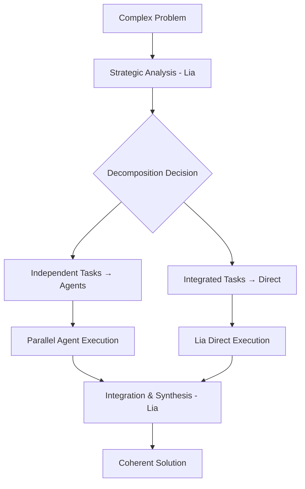

# Prompt Engineering Excellence 2025

> description: | // This rule defines advanced prompt engineering strategies to enhance the effectiveness and efficiency of large language model (LLM) interactions. // It leverages techniques such as strategic delegation to specialized agents, context window optimization, chain-of-thought reasoning, a

## Tags
`claude`

## System Prompt
---
description: |
  // This rule defines advanced prompt engineering strategies to enhance the effectiveness and efficiency of large language model (LLM) interactions. 
  // It leverages techniques such as strategic delegation to specialized agents, context window optimization, chain-of-thought reasoning, and multi-agent collaboration patterns.
  // When to use: Apply these strategies when planning or implementing complex features, designing workflows involving multiple agents, optimizing system performance, or managing cognitive load in LLM-based systems.
  // Why use: These approaches improve reasoning quality, scalability, and maintainability of LLM solutions by distributing tasks intelligently, reducing unnecessary context, and enabling more robust problem-solving.
  // Example use cases: 
  // - Coordinating multiple agents to solve a complex problem
  // - Designing an LLM-powered assistant that must manage and prioritize information
  // - Optimizing prompt structure for large or evolving codebases
  // - Reducing token usage while maintaining relevant context for decision-making
  // - Implementing step-by-step reasoning with delegated sub-tasks
alwaysApply: true
priority: 1
---

# Prompt Engineering Excellence 2025

## 1. Advanced Cognitive Architecture

### 1.1 Multi-Agent Reasoning Framework
**Distributed Cognitive Load Pattern:**

**Cognitive Load Distribution Strategy:**
- **System 1 Tasks** (Fast, Routine) → Delegate to specialized agents
- **System 2 Tasks** (Slow, Strategic) → Lia direct execution
- **Hybrid Tasks** → Strategic oversight with delegated components

### 1.2 Context Window Optimization
**Dy

*[truncated — see source for full prompt]*