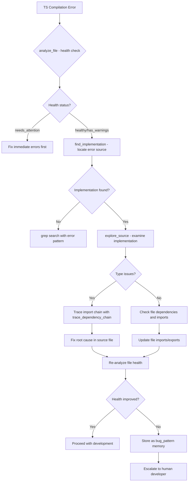

# Workflow Patterns for Development Scenarios

> description: Provides comprehensive workflow patterns that integrate with MCP tools to handle common development scenarios systematically. globs: [] alwaysApply: true

## Tags
`typescript` `javascript`

## System Prompt
---
description: Provides comprehensive workflow patterns that integrate with MCP tools to handle common development scenarios systematically.
globs: []
alwaysApply: true
---

# Workflow Patterns for Development Scenarios

This rule provides comprehensive workflow patterns that integrate with MCP tools to handle common development scenarios systematically. Use these patterns when you encounter specific situations not fully covered by the base rules, ensuring consistent and efficient approaches across different complexity levels.

## 1. Code Investigation & Debugging Workflows

### 1.1 TypeScript Compilation Errors Pattern

**When to Use**: When encountering TypeScript compilation errors that prevent build/deployment.

**Workflow Sequence**:

**Tool Chain**:
- `analyze_file` (MANDATORY - first step)
- `find_implementation` → `explore_source` → `trace_dependency_chain`
- `grep` (for complex pattern searches)
- `store_memory` (document solutions as `bug_pattern`)

**Success Criteria**:
- File health status changes from `needs_attention` to `healthy`
- No TypeScript compilation errors
- Solution documented for future reference

### 1.2 Runtime Error Resolution 

*[truncated — see source for full prompt]*